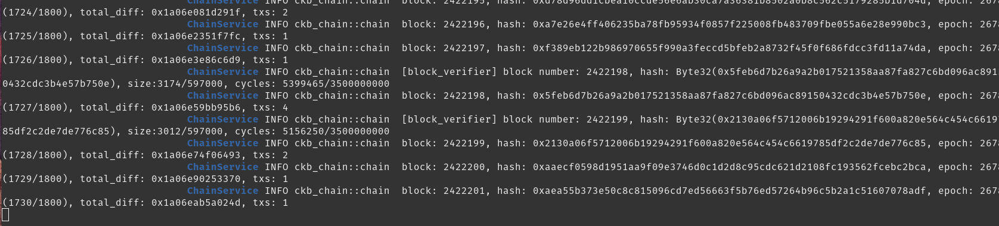
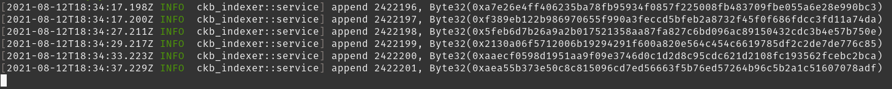

# Gitcoin 0 - Setup a Local CKB Node and CKB Indexer for the Testnet

https://gitcoin.co/issue/nervosnetwork/grants/1/100026176

## Prerequisites

```bash
sudo apt install build-essential git curl p7zip-full python2
nvm use 14
npm i -g yarn
# Docker : https://docs.docker.com/get-docker/
```

## 1. Setup a CKB Node

What is a `CKB Node` : https://github.com/Kuzirashi/gw-gitcoin-instruction/blob/master/src/conceptual-explainers/tooling.md#ckb-node

Binaries : https://github.com/nervosnetwork/ckb/releases/tag/v0.43.1

```bash
curl -LO https://github.com/nervosnetwork/ckb/releases/download/v0.43.1/ckb_v0.43.1_x86_64-unknown-linux-gnu.tar.gz
tar xzf ckb_v0.43.1_x86_64-unknown-linux-gnu.tar.gz
mv ckb_v0.43.1_x86_64-unknown-linux-gnu ckb_v0.43.1
# To use ckb-cli from any directory
echo 'export PATH=$PATH:~/Nervos-Hackaton/ckb_v0.43.1' >> ~/.bashrc
```

```bash
cd ~/Nervos-Hackaton/ckb_v0.43.1

# Initialize the node to the testnet before syncing
./ckb init --chain testnet

# Start syncing from scratch
./ckb run

# Or restore a snapshot
# See : https://ckb.tools/bootstrap
cd ~/Nervos-Hackaton/ckb_v0.43.1 && curl -sSf https://raw.githubusercontent.com/Kuzirashi/gw-gitcoin-instruction/master/scripts/install_ckb_node_snapshot_data.sh | sh
# It will download a compressed file containing data of the blockchain and install it in the right folders

# Init and finishing the syncing
# Disabling the console output save resources
./ckb init --chain testnet && ./ckb run 1>/dev>null
```

Block explorer for testnet Aggron : https://explorer.nervos.org/aggron/

### Screenshot

Node fully synchronized :



## 2. Setup a CKB Indexer

What is a `CKB Indexer` : https://github.com/Kuzirashi/gw-gitcoin-instruction/blob/master/src/conceptual-explainers/tooling.md#ckb-indexer

Binaries : https://github.com/nervosnetwork/ckb-indexer/releases/tag/v0.2.1

```bash
mkdir ~/Nervos-Hackaton/ckb-indexer && cd ~/Nervos-Hackaton/ckb-indexer
curl -LO https://github.com/nervosnetwork/ckb-indexer/releases/download/v0.2.1/ckb-indexer-0.2.1-linux.zip
unzip ckb-indexer-0.2.1-linux.zip
tar xzf ckb-indexer-linux-x86_64.tar.gz
```

```bash
# Run the indexer, the node must be running
# Starts indexing data from the local node
RUST_LOG=info ./ckb-indexer -s ./indexer-data

# Or restore a snapshot
curl -sSf https://raw.githubusercontent.com/Kuzirashi/gw-gitcoin-instruction/master/scripts/install_ckb_indexer_snapshot_data.sh | sh

# Run the indexer, RUST_LOG=warn to get rid of all console outputs and save resources
RUST_LOG=warn ./ckb-indexer -s ./indexer-data
```

### Screenshot

Indexer fully synchronized with local node :


