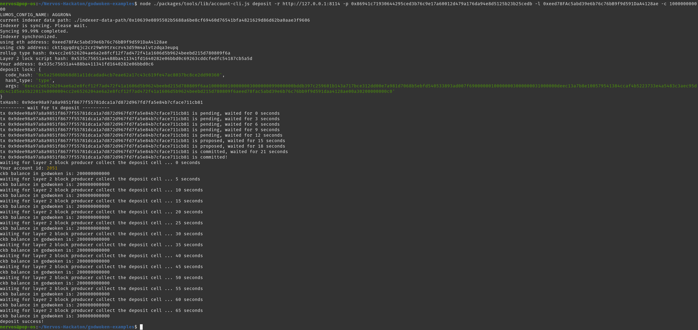

# Gitcoin: 1 - Create a Godwoken Account on the EVM Layer 2 Testnet

https://gitcoin.co/issue/nervosnetwork/grants/2/100026208

Documentation :
- https://github.com/Kuzirashi/gw-gitcoin-instruction/tree/master/src/conceptual-explainers
- https://github.com/nervosnetwork/ckb-cli/blob/develop/README.md
- https://github.com/Kuzirashi/gw-gitcoin-instruction/blob/master/src/component-tutorials/1.setup.account.in.ckb.cli.md
- https://github.com/Kuzirashi/gw-gitcoin-instruction/blob/master/src/component-tutorials/4.layer2.deposit.md
- https://github.com/Kuzirashi/gw-gitcoin-instruction/blob/master/src/component-tutorials/3.setup.and.use.account.cli.md

## 1. Create and Fund an Account with CKBytes on Layer 1

```bash
# I do not provide --url parameter because I use my local (testnet) node
ckb-cli
> account new
```

Layer 1 created account values :
```
address:
  mainnet: ckb1qyqdrqjc2cr29wh9trxcrv43d59m4alvtzdqq58rdu
  testnet: ckt1qyqdrqjc2cr29wh9trxcrv43d59m4alvtzdqa3eupq
lock_arg: 0xd182585606a2bae558cd81b2b16d0bbaf7ec589a
lock_hash: 0xbddb397c259601b143a717bce312dd00e7a981d7068b5ebfd540533893ad007f
```

### Screenshot


Testnet faucet : https://faucet.nervos.org/
After providing my Aggron address `ckt1qyqdrqjc2cr29wh9trxcrv43d59m4alvtzdqa3eupq`, I received **10 000 CKB**.

### Layer 1 address on Testnet Explorer

We can check that using the testnet block explorer : https://explorer.nervos.org/aggron/address/ckt1qyqdrqjc2cr29wh9trxcrv43d59m4alvtzdqa3eupq

### Exporting my private key

```bash
ckb-cli account export --lock-arg 0xd182585606a2bae558cd81b2b16d0bbaf7ec589a --extended-privkey-path /home/nervos/Nervos-Hackaton/1-Godwoken-account/privkey.txt
```

Content of `privkey.txt`
```
86941c71930644295ced3b76c9e17a60012d479a176da94e8d5125b23b25cedb
c7a05f3439750ac17c992b3b5c84c1292b4664da5e652a2e1228547a8fa35663
```

The private key is the first line with a `0x` prefix : `0x86941c71930644295ced3b76c9e17a60012d479a176da94e8d5125b23b25cedb`

## 2. Deposit some CKBytes on Layer 2

Setting up the `account-cli` tool :
```bash
git clone https://github.com/Kuzirashi/godwoken-examples -b testnet-script
cd godwoken-examples && yarn && yarn build-all
yarn generate-testnet-configs
```

My Ethereum address : `0xeed78FAc5abd39e6b76c76bB9f9d591DaA4128ae`
Testing this tool :
```bash
node ./packages/tools/lib/account-cli.js to-short-address -a 0xeed78FAc5abd39e6b76c76bB9f9d591DaA4128ae
> godwoken short address: 0x535c75651a4488ba411341fd1640282e06bbd0c6
```
My Ethereum address has been converted into a `Polyjuice` **layer 2** address, because Nervos aims to be interoperable with several blockchains, they need to convert addresses from different blockchains into a single `Polyjuice` address.

```bash
node ./packages/tools/lib/account-cli.js to-eth-address -a 0x535c75651a4488ba411341fd1640282e06bbd0c6
> Error: unable to fetch eth address from 0x535c75651a4488ba411341fd1640282e06bbd0c6
```
This error happens because the account `0x535c75651a4488ba411341fd1640282e06bbd0c6` has not been created. Let's do this by deposit funds to it :
```bash
node ./packages/tools/lib/account-cli.js deposit -r http://127.0.0.1:8114 -p 0x86941c71930644295ced3b76c9e17a60012d479a176da94e8d5125b23b25cedb -l 0xeed78FAc5abd39e6b76c76bB9f9d591DaA4128ae -c 100000000000
```
`-l` specifies an Ethereum address
I must provide my private key to allow `account-cli` to manage my account
The amount is expressed in `Shannons`, 1 CKB = 100,000,000 Shannons

The `account-cli` tool uses a built in CKB Indexer, which needs to fully synchronize with a Testnet CKB Node before it can create transactions. It's possible to download a snapshot, which could be done by running :
```bash
chmod +x get-testnet-snapshot-data.sh
./get-testnet-snapshot-data.sh
```

After syncing, the deposit is successful :


Here is the transaction : https://explorer.nervos.org/aggron/transaction/0x9dee98a97a8a9851f8677f55781dca1a7d872d967fd7fa5e84b7cface711cb81

Now that our layer 2 account is created, this command doesn't return an error anymore :
```bash
node ./packages/tools/lib/account-cli.js to-eth-address -a 0x535c75651a4488ba411341fd1640282e06bbd0c6
> eth eoa address: 0xeed78fac5abd39e6b76c76bb9f9d591daa4128ae
```
