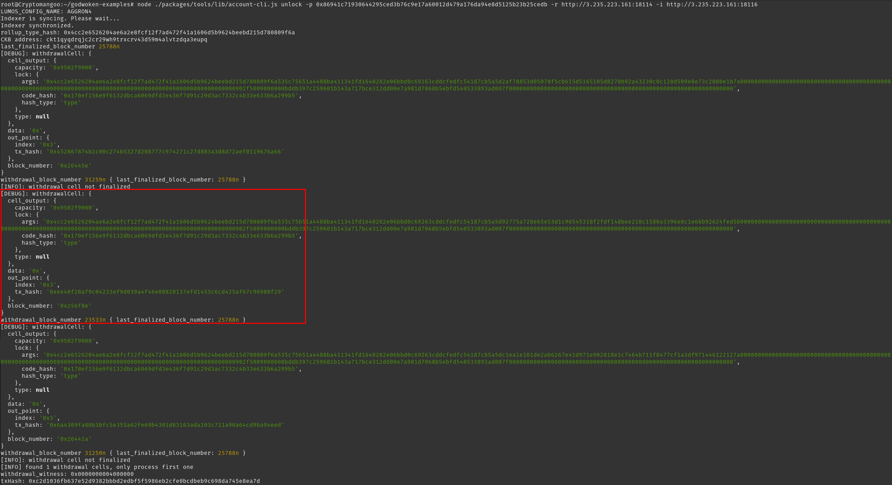
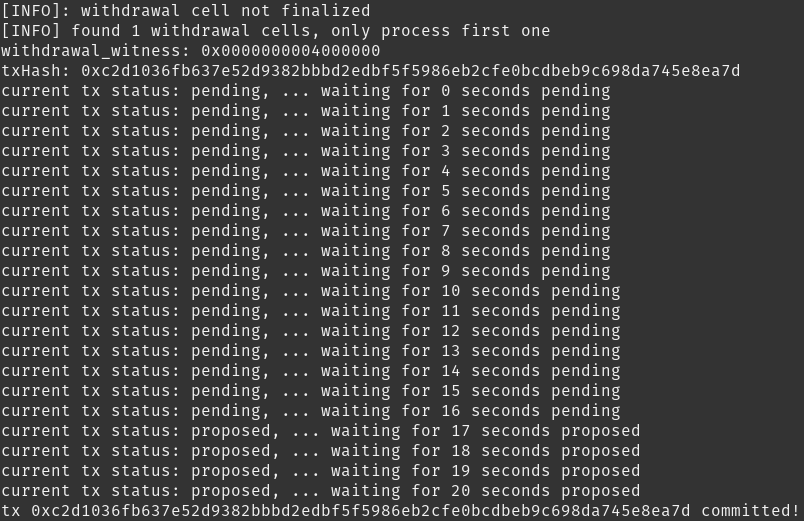

# Gitcoin: 10 - Complete Withdrawal Process by Unlocking the Funds

https://gitcoin.co/issue/nervosnetwork/grants/11/100026217

## 1. Execute the Unlock Command

```bash
cd godwoken-examples
node ./packages/tools/lib/account-cli.js unlock -p <YOUR_LAYER_1_PRIVATE_KEY> -r <INSERT_TESTNET_RPC_URL> -i <INSERT_TESTNET_INDEXER_URL>
```

The command becomes :
```bash
node ./packages/tools/lib/account-cli.js unlock -p 0x86941c71930644295ced3b76c9e17a60012d479a176da94e8d5125b23b25cedb -r http://127.0.0.1:8114 -i http://127.0.0.1:8116 
```

The private key you pass to unlock command needs to be the same as the one that corresponds with the Layer 1 address that was previously used with the withdraw and deposit.

```
[INFO]: withdrawal cell not finalized
[DEBUG]: withdrawalCell: {
  cell_output: {
    capacity: '0x9502f9000',
    lock: {
      args: '0x4cc2e6526204ae6a2e8fcf12f7ad472f41a1606d5b9624beebd215d780809f6a535c75651a4488ba411341fd1640282e06bbd0c69263cddcfedfc54187cb5a5d92775a728e65e53d1c96545318f2fdf148bee210c1580a3396e0c1e66b92624fed5b00000000000000000000000000000000000000000000000000000000000000000000000000000000000000000000000000000000000000902f5009000000bddb397c259601b143a717bce312dd00e7a981d7068b5ebfd540533893ad007f0000000000000000000000000000000000000000000000000000000000000000',
      code_hash: '0x170ef156e9f6132dbca6069dfd3e436f7d91c29d3ac7332c4b33e633b6a299b5',
      hash_type: 'type'
    },
    type: null
  },
  data: '0x',
  out_point: {
    index: '0x3',
    tx_hash: '0xee40f28af9c04233ef9d039a4f46e08820137efd1453c6cd425af67c96988f29'
  },
  block_number: '0x256f8e'
}
withdrawal_block_number 23533n { last_finalized_block_number: 21265n }
```

I need to wait for `last_finalized_block_number` to be greater than `withdrawal_block_number`...

Now, it works, my funds are now available on Layer 1 :





Output :
```
[INFO] found 1 withdrawal cells, only process first one
withdrawal_witness: 0x0000000004000000
txHash: 0xc2d1036fb637e52d9382bbbd2edbf5f5986eb2cfe0bcdbeb9c698da745e8ea7d
current tx status: pending, ... waiting for 0 seconds pending
current tx status: pending, ... waiting for 1 seconds pending
current tx status: pending, ... waiting for 2 seconds pending
current tx status: pending, ... waiting for 3 seconds pending
current tx status: pending, ... waiting for 4 seconds pending
current tx status: pending, ... waiting for 5 seconds pending
current tx status: pending, ... waiting for 6 seconds pending
current tx status: pending, ... waiting for 7 seconds pending
current tx status: pending, ... waiting for 8 seconds pending
current tx status: pending, ... waiting for 9 seconds pending
current tx status: pending, ... waiting for 10 seconds pending
current tx status: pending, ... waiting for 11 seconds pending
current tx status: pending, ... waiting for 12 seconds pending
current tx status: pending, ... waiting for 13 seconds pending
current tx status: pending, ... waiting for 14 seconds pending
current tx status: pending, ... waiting for 15 seconds pending
current tx status: pending, ... waiting for 16 seconds pending
current tx status: proposed, ... waiting for 17 seconds proposed
current tx status: proposed, ... waiting for 18 seconds proposed
current tx status: proposed, ... waiting for 19 seconds proposed
current tx status: proposed, ... waiting for 20 seconds proposed
tx 0xc2d1036fb637e52d9382bbbd2edbf5f5986eb2cfe0bcdbeb9c698da745e8ea7d committed!
```
