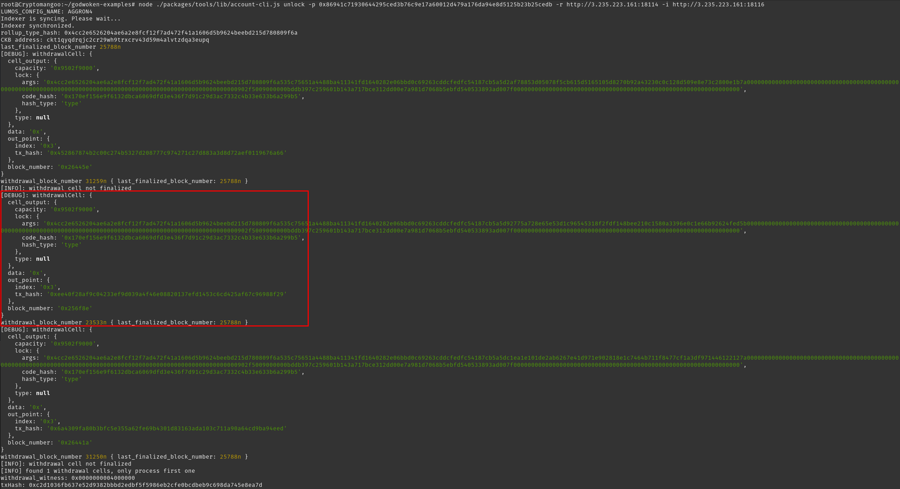
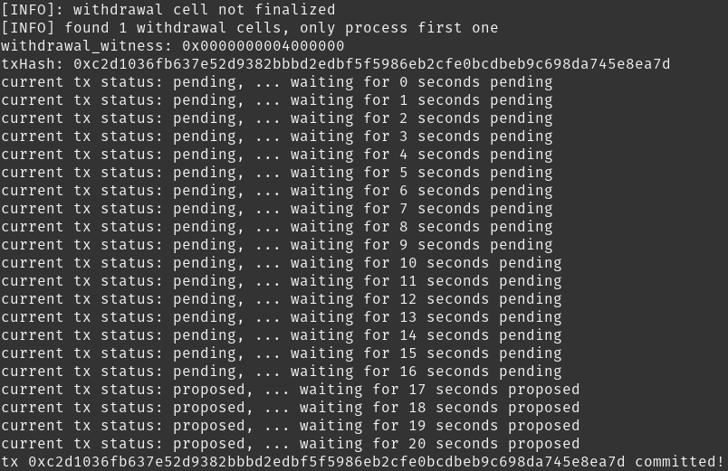

# 1. A screenshot of the console output immediately after running the "unlock" command

# 2. The Ethereum address that you've used for your Layer 2 account (in text format)

0xeed78FAc5abd39e6b76c76bB9f9d591DaA4128ae

# 3. The Nervos Layer 1 address associated with the private key passed to "unlock" command (in text format). This is "ckb address" in the console output

ckt1qyqdrqjc2cr29wh9trxcrv43d59m4alvtzdqa3eupq
