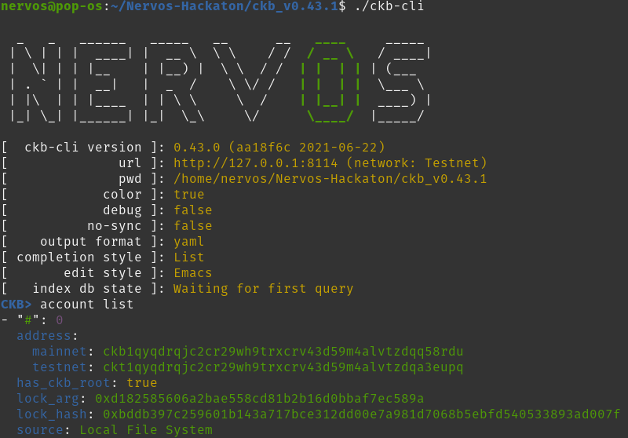
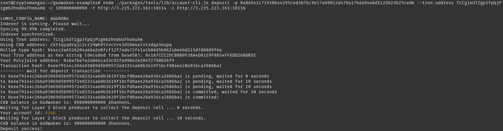
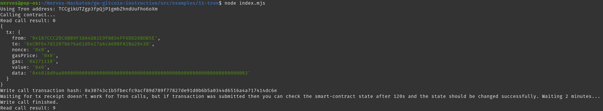

# Gitcoin: 11 - Use a Tron Wallet to Execute a Smart Contract Call

## 1. Create and Fund an Account with CKBytes on Layer 1

I already created and funded an account during the previous tasks :



https://explorer.nervos.org/aggron/address/ckt1qyqdrqjc2cr29wh9trxcrv43d59m4alvtzdqa3eupq

## 2. Install a Tron Wallet and Create an Account

Follow the tutorial : https://github.com/Kuzirashi/gw-gitcoin-instruction/blob/master/src/component-tutorials/8.setup.tronlink.md

See : https://www.tronlink.org/

## 3. Export Your Tron Account Private Key

Follow the tutorial : https://github.com/Kuzirashi/gw-gitcoin-instruction/tree/master/src/component-tutorials/10.extract.tron.private.key.md

Tron private key : `0x38c9ca6277989d20df28855ccb0e1ebc35c15bae4760f93b356ffd091b8a47d3`

## 4. Create and Fund a Nervos Layer 2 Account Using Your Tron Account

Follow the tutorial : https://github.com/Kuzirashi/gw-gitcoin-instruction/blob/master/src/component-tutorials/9.layer2.deposit.tron.md

Nervos Layer 1 private key : `0x86941c71930644295ced3b76c9e17a60012d479a176da94e8d5125b23b25cedb`

Tron address : `TCCgikUTZgp3fpQjP1gmbZhndUuFho6oXm`

Let's deposit `3000CKB` (300000000000 Shannons)

```bash
node ./packages/tools/lib/account-cli.js deposit -p 0x86941c71930644295ced3b76c9e17a60012d479a176da94e8d5125b23b25cedb --tron-address TCCgikUTZgp3fpQjP1gmbZhndUuFho6oXm -c 100000000000 -r http://3.235.223.161:18114 -i http://3.235.223.161:18116
```

The deposit is successfull :



Output :
```
LUMOS_CONFIG_NAME: AGGRON4
Indexer is syncing. Please wait...
Syncing 99.99% completed.
Indexer synchronized.
Using Tron address: TCCgikUTZgp3fpQjP1gmbZhndUuFho6oXm
Using CKB address: ckt1qyqdrqjc2cr29wh9trxcrv43d59m4alvtzdqa3eupq
Rollup type hash: 0x4cc2e6526204ae6a2e8fcf12f7ad472f41a1606d5b9624beebd215d780809f6a
Your Tron address as hex string (decoded from base58): 0x187CCC2DC8BB9F38A4D81E9F8854FF6DD26BDB5E
Your Polyjuice address: 0x8a76e7a2ab6eca33c92fa990e2e204f2750026f9
Transaction hash: 0xee79144c266a93069d5b99572ed3314a68b3619f1bcfd0aee28a936ca2686ba1
--------- wait for deposit transaction ----------
tx 0xee79144c266a93069d5b99572ed3314a68b3619f1bcfd0aee28a936ca2686ba1 is pending, waited for 0 seconds
tx 0xee79144c266a93069d5b99572ed3314a68b3619f1bcfd0aee28a936ca2686ba1 is pending, waited for 10 seconds
tx 0xee79144c266a93069d5b99572ed3314a68b3619f1bcfd0aee28a936ca2686ba1 is pending, waited for 20 seconds
tx 0xee79144c266a93069d5b99572ed3314a68b3619f1bcfd0aee28a936ca2686ba1 is committed, waited for 30 seconds
tx 0xee79144c266a93069d5b99572ed3314a68b3619f1bcfd0aee28a936ca2686ba1 is committed!
CKB balance in Godwoken is: 800000000000 Shannons.
Waiting for Layer 2 block producer to collect the deposit cell ... 0 seconds.
Your account id: 3166
Waiting for Layer 2 block producer to collect the deposit cell ... 10 seconds.
CKB balance in Godwoken is: 900000000000 Shannons.
Deposit success!
```

## 5. Prepare the Smart Contract Address and ABI

Deploy a `SimpleCalculator` contract :
```
Found file: ./build/contracts/SimpleCalculator.json
Deploying contract...
Transaction hash: 0x28fcadb5f2166d58474e9ecd6febfdb85b30d5be51f6f8e6371079b21fae13c8
Deployed contract address: 0xCBF647d1207bb76a61d5417a6cA608FA1Ba28430
```

Contract address : 0xCBF647d1207bb76a61d5417a6cA608FA1Ba28430

ABI :
```json
[
    {
      "inputs": [
        {
          "internalType": "uint256",
          "name": "n",
          "type": "uint256"
        }
      ],
      "name": "setX",
      "outputs": [],
      "stateMutability": "payable",
      "type": "function"
    },
    {
      "inputs": [],
      "name": "pow",
      "outputs": [
        {
          "internalType": "uint256",
          "name": "",
          "type": "uint256"
        }
      ],
      "stateMutability": "view",
      "type": "function"
    }
]
```

## 6. Prepare and Run the Example Code to Call the Smart Contract

Open `gw-gitcoin-instruction/src/examples/11-tron/index.mjs` and replace the values :
- `<YOUR_TRON_ADDRESS>` : `TCCgikUTZgp3fpQjP1gmbZhndUuFho6oXm`
- `<YOUR_TRON_PRIVATE_KEY>` : `0x38c9ca6277989d20df28855ccb0e1ebc35c15bae4760f93b356ffd091b8a47d3`
- `<YOUR_CONTRACT_ABI>` : `[ ... ]`
- `<YOUR_CONTRACT_ADDRESS>` : `0xCBF647d1207bb76a61d5417a6cA608FA1Ba28430`
- `<YOUR_READ_FUNCTION_NAME>` : `pow`
- `<YOUR_WRITE_FUNCTION_NAME>` : `setX(3)`

Then :
```bash
node gw-gitcoin-instruction/src/examples/11-tron/index.mjs
```



Ouput :
```
Using Tron address: TCCgikUTZgp3fpQjP1gmbZhndUuFho6oXm
Calling contract...
Read call result: 0
{
  tx: {
    from: '0x187CCC2DC8BB9F38A4D81E9F8854FF6DD26BDB5E',
    to: '0xCBF647d1207bb76a61d5417a6cA608FA1Ba28430',
    nonce: '0x0',
    gasPrice: '0x0',
    gas: '0x271110',
    value: '0x0',
    data: '0x4018d9aa0000000000000000000000000000000000000000000000000000000000000003'
  }
}
Write call transaction hash: 0x30743c1b5fbecfc9acf89d789f77827de91d0b6b5a0344d6516a4a717414dc6e
Waiting for tx receipt doesn't work for Tron calls, but if transaction was submitted then you can check the smart-contract state after 120s and the state should be changed successfully. Waiting 2 minutes...
Write call finished.
Read call result: 9
```

First, `pow()` is called and returns `0` because `setX()` has never been called. Then, `setX(3)` is called, so `pow()` returns `3 * 3 = 9`.
