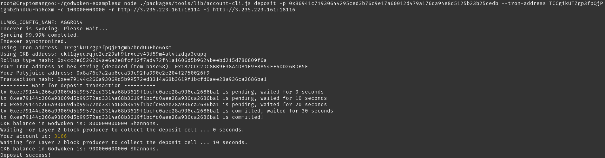

# 1. A screenshot of the accounts you created (account list) in ckb-cli


# 2. A link to the Layer 1 address you funded on the Testnet Explorer

https://explorer.nervos.org/aggron/address/ckt1qyqdrqjc2cr29wh9trxcrv43d59m4alvtzdqa3eupq

# 3. A screenshot of the console output immediately after you have successfully submitted a CKByte deposit to your Tron account on Layer 2



# 4. A screenshot of the console output immediately after you have successfully issued a smart contract calls on Layer 2


# 5. The transaction hash of the "Contract call" from the console output (in text format)

0x30743c1b5fbecfc9acf89d789f77827de91d0b6b5a0344d6516a4a717414dc6e

# 6. The contract address that you called (in text format)

0xCBF647d1207bb76a61d5417a6cA608FA1Ba28430

# 7. The ABI for contract you made a call on (in text format)

```json
[
    {
      "inputs": [
        {
          "internalType": "uint256",
          "name": "n",
          "type": "uint256"
        }
      ],
      "name": "setX",
      "outputs": [],
      "stateMutability": "payable",
      "type": "function"
    },
    {
      "inputs": [],
      "name": "pow",
      "outputs": [
        {
          "internalType": "uint256",
          "name": "",
          "type": "uint256"
        }
      ],
      "stateMutability": "view",
      "type": "function"
    }
]
```

# 8. Your Tron address (in text format)

TCCgikUTZgp3fpQjP1gmbZhndUuFho6oXm
