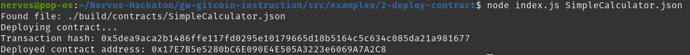

# Gitcoin: 2 - Deploy a Simple Ethereum Smart Contract on Polyjuice

https://gitcoin.co/issue/nervosnetwork/grants/3/100026209

## Prerequisites

### 1. Prepare Your Ethereum Private Key

My Ethereum private key : `cde930b2d7425acd30909d7a89c89978921da051b1855d5f6a7b13ad44c970b2`
Which has funds on layer 2 so it can pay the gas fees.

### 2. Clone and Setup the Gitcoin Task Instruction Examples

```bash
git clone https://github.com/kuzirashi/gw-gitcoin-instruction && cd gw-gitcoin-instruction
yarn install-all
```

### 3. Compile the Smart Contract and Copy the Artifact

Smart contract used :
```solidity
pragma solidity >=0.8.0;

contract SimpleCalculator {
  uint a;
  uint b;

  function setA(uint x) public payable {
    a = x;
  }
  
  function setB(uint x) public payable {
    b = x;
  }
  
  function mul() public view returns (uint) {
      return a * b;
  }
}
```

```bash
cd ~/Nervos-Hackaton/gw-gitcoin-instruction/src/examples/2-deploy-contract/
# Deposit SimpleCalculator.sol in contracts folder before compiling

# Will compile the smart contract using ethereum/solc:0.8.3 Docker image
yarn compile

# The compiler has generated SimpleCalculator.json file in the build/ folder
```

### 4. Deploy a Smart Contract Using Web3.js

Let's replace my private key `<YOUR_ETHEREUM_PRIVATE_KEY>` in `index.js` file which is the deployment script, and execute it :
```bash
node index.js SimpleCalculator.json
```

Deployment successfull :
```
Found file: ./build/contracts/SimpleCalculator.json
Deploying contract...
Transaction hash: 0xb71efdc312519193fe46a0b004cc4ab0998629401cc67264026ce41a731fd706
Deployed contract address: 0x1048791FBe7769859cac850Bff96db93fDCA434E
```


