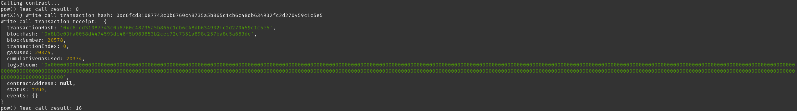

# 1. Screenshot of the console output immediately after you have successfully issued a smart contract call



# 2. Transaction hash from the console output (in text format)

0xc6fcd31087743c0b6760c48735a5b865c1cb6c48db634932fc2d270459c1c5e5

# 3. Contract address that you called (in text format)

0x17E7B5e5280bC6E090E4E505A3223e6069A7A2C8

# 4. ABI for contract you made a call on (in text format)

```json
[
  {
    "inputs": [
      {
        "internalType": "uint256",
        "name": "n",
        "type": "uint256"
      }
    ],
    "name": "setX",
    "outputs": [],
    "stateMutability": "payable",
    "type": "function"
  },
  {
    "inputs": [],
    "name": "pow",
    "outputs": [
      {
        "internalType": "uint256",
        "name": "",
        "type": "uint256"
      }
    ],
    "stateMutability": "view",
    "type": "function"
  }
]
```