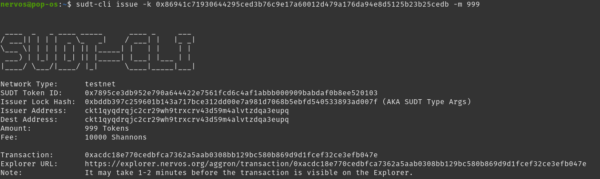
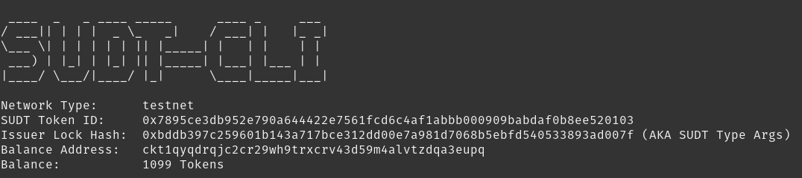
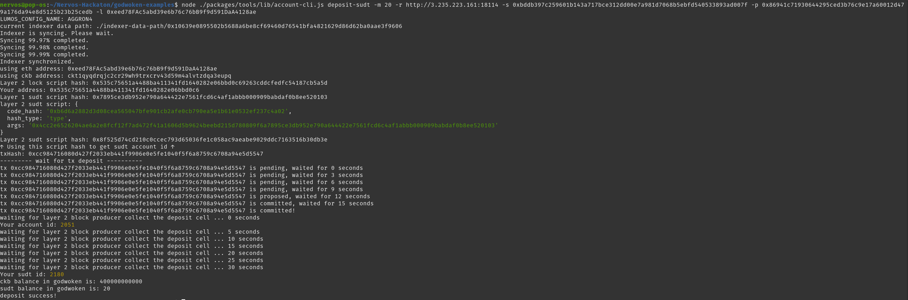

# Gitcoin: 4 - Issue an SUDT Token on Layer 1 and Deposit it to Layer 2

https://gitcoin.co/issue/nervosnetwork/grants/5/100026211

Documentation :
- https://github.com/Kuzirashi/gw-gitcoin-instruction/blob/master/src/component-tutorials/2.issue.sudt.cli.md

## 1. Setup a Layer 1 Account With Funds

Layer 1 testnet address : `ckt1qyqdrqjc2cr29wh9trxcrv43d59m4alvtzdqa3eupq`
Layer 1 testnet private key : `0x86941c71930644295ced3b76c9e17a60012d479a176da94e8d5125b23b25cedb`

It has been funded during the second task : https://explorer.nervos.org/aggron/address/ckt1qyqdrqjc2cr29wh9trxcrv43d59m4alvtzdqa3eupq

## 2. Use the sudt-cli Tool to Issue an SUDT Token on Layer 1

Installation :
```bash
npm i -g sudt-cli
# Check the installation
sudt-cli --version
> 0.5.24
```

Let's mint 999 tokens on layer 1 :
```
sudt-cli issue -k 0x86941c71930644295ced3b76c9e17a60012d479a176da94e8d5125b23b25cedb -m 999
```
`-k` parameter specifies my private key



Output :
```
Network Type:	   testnet
SUDT Token ID:	   0x7895ce3db952e790a644422e7561fcd6c4af1abbb000909babdaf0b8ee520103
Issuer Lock Hash:  0xbddb397c259601b143a717bce312dd00e7a981d7068b5ebfd540533893ad007f (AKA SUDT Type Args)
Issuer Address:	   ckt1qyqdrqjc2cr29wh9trxcrv43d59m4alvtzdqa3eupq
Dest Address:	   ckt1qyqdrqjc2cr29wh9trxcrv43d59m4alvtzdqa3eupq
Amount:		   999 Tokens
Fee:		   10000 Shannons

Transaction:	   0xacdc18e770cedbfca7362a5aab0308bb129bc580b869d9d1fcef32ce3efb047e
Explorer URL:	   https://explorer.nervos.org/aggron/transaction/0xacdc18e770cedbfca7362a5aab0308bb129bc580b869d9d1fcef32ce3efb047e
Note:		   It may take 1-2 minutes before the transaction is visible on the Explorer.
```

We can see the amount in `cell info` -> `data`. It is encoded in little endian hexadecimal, so `0xe7030000000000000000000000000000` is `0x03e7` which is equal to `999`.

After the transaction is mined, let's check my balance :
```bash
sudt-cli balance -k 0x86941c71930644295ced3b76c9e17a60012d479a176da94e8d5125b23b25cedb
```



Output :
```
 ____  _   _ ____ _____      ____ _     ___ 
/ ___|| | | |  _ \_   _|    / ___| |   |_ _|
\___ \| | | | | | || |_____| |   | |    | | 
 ___) | |_| | |_| || |_____| |___| |___ | | 
|____/ \___/|____/ |_|      \____|_____|___|

Network Type:	   testnet
SUDT Token ID:	   0x7895ce3db952e790a644422e7561fcd6c4af1abbb000909babdaf0b8ee520103
Issuer Lock Hash:  0xbddb397c259601b143a717bce312dd00e7a981d7068b5ebfd540533893ad007f (AKA SUDT Type Args)
Balance Address:   ckt1qyqdrqjc2cr29wh9trxcrv43d59m4alvtzdqa3eupq
Balance:	   1099 Tokens
```

I have `1099` tokens because I made another `SUDT issue` transaction for `100` tokens.

## 3. Setup the Godwoken Examples Tool Package

Already installed

## 4. Deposit Layer 1 SUDT Tokens to on Layer 2

Let's send some SUDT tokens from layer 1 to layer 2 :
```bash
node ./packages/tools/lib/account-cli.js deposit-sudt -m 20 -r http://3.235.223.161:18114 -s 0xbddb397c259601b143a717bce312dd00e7a981d7068b5ebfd540533893ad007f -p 0x86941c71930644295ced3b76c9e17a60012d479a176da94e8d5125b23b25cedb -l 0xeed78FAc5abd39e6b76c76bB9f9d591DaA4128ae
```
`-m` : the amount of SUDT tokens
`-r` : the testnet RPC URL of a node
`-s` : the lock hash obtained during the creation of my layer 1 account, also visible in the output of the `sudt-cli` commands
`-p` : layer 1 private key
`-l` : my Ethereum address which will receive the SUDT tokens on layer 2



Output :
```
LUMOS_CONFIG_NAME: AGGRON4
current indexer data path: ./indexer-data-path/0x10639e0895502b5688a6be8cf69460d76541bfa4821629d86d62ba0aae3f9606
Indexer is syncing. Please wait.
Syncing 99.97% completed.
Syncing 99.98% completed.
Syncing 99.99% completed.
Indexer synchronized.
using eth address: 0xeed78FAc5abd39e6b76c76bB9f9d591DaA4128ae
using ckb address: ckt1qyqdrqjc2cr29wh9trxcrv43d59m4alvtzdqa3eupq
Layer 2 lock script hash: 0x535c75651a4488ba411341fd1640282e06bbd0c69263cddcfedfc54187cb5a5d
Your address: 0x535c75651a4488ba411341fd1640282e06bbd0c6
Layer 1 sudt script hash: 0x7895ce3db952e790a644422e7561fcd6c4af1abbb000909babdaf0b8ee520103
layer 2 sudt script: {
  code_hash: '0xb6d6a2882d3d08cea565047bfe901cb2afe0cb790ea5e1b61e0532ef237c4a02',
  hash_type: 'type',
  args: '0x4cc2e6526204ae6a2e8fcf12f7ad472f41a1606d5b9624beebd215d780809f6a7895ce3db952e790a644422e7561fcd6c4af1abbb000909babdaf0b8ee520103'
}
Layer 2 sudt script hash: 0x8f525d74cd210c0ccec793d65036fe1c058ac9aeabe9029ddc7163516b30db3e
↑ Using this script hash to get sudt account id ↑
txHash: 0xcc984716080d427f2033eb441f9906e0e5fe1040f5f6a8759c6708a94e5d5547
--------- wait for tx deposit ----------
tx 0xcc984716080d427f2033eb441f9906e0e5fe1040f5f6a8759c6708a94e5d5547 is pending, waited for 0 seconds
tx 0xcc984716080d427f2033eb441f9906e0e5fe1040f5f6a8759c6708a94e5d5547 is pending, waited for 3 seconds
tx 0xcc984716080d427f2033eb441f9906e0e5fe1040f5f6a8759c6708a94e5d5547 is pending, waited for 6 seconds
tx 0xcc984716080d427f2033eb441f9906e0e5fe1040f5f6a8759c6708a94e5d5547 is pending, waited for 9 seconds
tx 0xcc984716080d427f2033eb441f9906e0e5fe1040f5f6a8759c6708a94e5d5547 is proposed, waited for 12 seconds
tx 0xcc984716080d427f2033eb441f9906e0e5fe1040f5f6a8759c6708a94e5d5547 is committed, waited for 15 seconds
tx 0xcc984716080d427f2033eb441f9906e0e5fe1040f5f6a8759c6708a94e5d5547 is committed!
waiting for layer 2 block producer collect the deposit cell ... 0 seconds
Your account id: 2051
waiting for layer 2 block producer collect the deposit cell ... 5 seconds
waiting for layer 2 block producer collect the deposit cell ... 10 seconds
waiting for layer 2 block producer collect the deposit cell ... 15 seconds
waiting for layer 2 block producer collect the deposit cell ... 20 seconds
waiting for layer 2 block producer collect the deposit cell ... 25 seconds
waiting for layer 2 block producer collect the deposit cell ... 30 seconds
Your sudt id: 2180
ckb balance in godwoken is: 400000000000
sudt balance in godwoken is: 20
deposit success!
```

Now the layer 2 account associated with my Ethereum address has a balance of 20 SUDT of id `2180`.
Transaction : https://explorer.nervos.org/aggron/transaction/0xcc984716080d427f2033eb441f9906e0e5fe1040f5f6a8759c6708a94e5d5547
