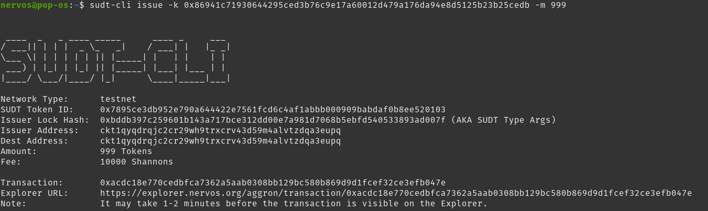
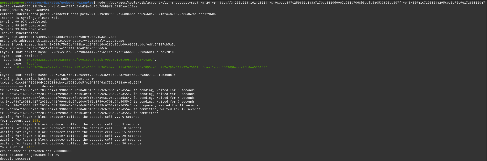

# 1. Link to the Layer 1 address you funded on the Testnet Explorer

https://explorer.nervos.org/aggron/address/ckt1qyqdrqjc2cr29wh9trxcrv43d59m4alvtzdqa3eupq

# 2. Screenshot of the console output immediately after using sudt-cli to create your SUDT tokens on Layer 1

# 3. Link to the transaction ID created by sudt-cli on the Testnet Explorer

https://explorer.nervos.org/aggron/transaction/0xacdc18e770cedbfca7362a5aab0308bb129bc580b869d9d1fcef32ce3efb047e

# 4. Screenshot of the console output immediately after you have successfully submitted a deposit to Layer 2 using the account-cli tool

# 5. SUDT ID from the console output after executing the deposit script (in text format)

2180
