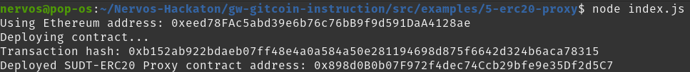
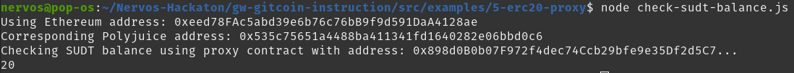
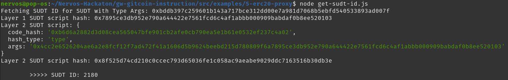

# Gitcoin: 5 - Deploy the ERC20 Proxy Contract for the Deposited SUDT

https://gitcoin.co/issue/nervosnetwork/grants/6/100026212

The ERC20 Proxy Contract allows us to interact from layer 2 with SUDT tokens using an ERC20 interface.

## Prerequisites

SUDT id : `2180`, used to identify the SUDT token
Ethereum layer 2 private key : `0xcde930b2d7425acd30909d7a89c89978921da051b1855d5f6a7b13ad44c970b2`

## 1. Compile the Smart Contract and Copy the Artifact

```bash
cd ~/Nervos-Hackaton/gw-gitcoin-instruction/src/examples/5-erc20-proxy
yarn compile
# This generated 3 files : IERC20.json, ERC20.json, Context.json
# Because SudtERC20Proxy.sol contains several contracts
```

## 2. Deploy the SUDT-ERC20 Proxy Contract Using Web3.js

To deploy the proxy contract, replace the values in `gw-gitcoin-instruction/src/examples/5-erc20-proxy/index.js` :
```
<YOUR_ETHEREUM_PRIVATE_KEY>
<YOUR_SUDT_ID>
```

Somme known SUDT ids :
- ckETH: 30
- ckDAI: 35
- ckUSDT: 36
- ckUSDC: 37

`SUDT_NAME`, `SUDT_SYMBOL`, and `SUDT_TOTAL_SUPPLY` can be left as is, they are provided for ERC20 compatibility.

Run the script :
```bash
node index.js
```



Output :
```
Using Ethereum address: 0xeed78FAc5abd39e6b76c76bB9f9d591DaA4128ae
Deploying contract...
Transaction hash: 0xb152ab922bdaeb07ff48e4a0a584a50e281194698d875f6642d324b6aca78315
Deployed SUDT-ERC20 Proxy contract address: 0x898d0B0b07F972f4dec74Ccb29bfe9e35Df2d5C7
```

This created a 1:1 binding between the Ethereum smart contract and the Layer 2 SUDT token.

## 3. Check your Layer 2 SUDT balance

Let's check my token balance using `ERC20ProxyContract.balanceOf(polyjuiceAddress)`. When dealing with addresses on-chain in smart contract calls, we need to use Polyjuice address, which is the address that Layer 2 uses internally to track the Ethereum/Bitcoin/other chains/... address behind it. The addresses from all these different blockchains must be standardized to a single format that Nervos can utilize internally. Lets's update values in `src/examples/5-erc20-proxy/check-sudt-balance.js` :
```
<YOUR_ETHEREUM_ADDRESS> # Will be converted into a polyjuice address
<YOUR_SUDT_PROXY_CONTRACT_ADDRESS>
```

Run the script :
```bash
node check-sudt-balance.js
```

Success ! I can see my `20` tokens deposited in the last task.



Output :
```
Using Ethereum address: 0xeed78FAc5abd39e6b76c76bB9f9d591DaA4128ae
Corresponding Polyjuice address: 0x535c75651a4488ba411341fd1640282e06bbd0c6
Checking SUDT balance using proxy contract with address: 0x898d0B0b07F972f4dec74Ccb29bfe9e35Df2d5C7...
20
```

## Bonus: Get Layer 2 SUDT ID from Layer 1 SUDT Issuer Lock Hash (AKA SUDT Type Args)

Retrieve the Layer 2 SUDT ID of a deposited SUDT. The `<YOUR_SUDT_TYPE_ARGS>` is required for `src/examples/5-erc20-proxy/get-sudt-id.js`. The `SUDT Type Args` also refers to the layer 1 `lock hash`, here it is `0xbddb397c259601b143a717bce312dd00e7a981d7068b5ebfd540533893ad007f` :



Output :
```
Fetching SUDT ID for SUDT with Type Args: 0xbddb397c259601b143a717bce312dd00e7a981d7068b5ebfd540533893ad007f
Layer 1 SUDT script hash: 0x7895ce3db952e790a644422e7561fcd6c4af1abbb000909babdaf0b8ee520103
Layer 2 SUDT script: {
  code_hash: '0xb6d6a2882d3d08cea565047bfe901cb2afe0cb790ea5e1b61e0532ef237c4a02',
  hash_type: 'type',
  args: '0x4cc2e6526204ae6a2e8fcf12f7ad472f41a1606d5b9624beebd215d780809f6a7895ce3db952e790a644422e7561fcd6c4af1abbb000909babdaf0b8ee520103'
}
Layer 2 SUDT script hash: 0x8f525d74cd210c0ccec793d65036fe1c058ac9aeabe9029ddc7163516b30db3e

        >>>>> SUDT ID: 2180
```
