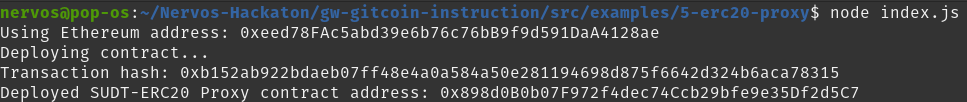
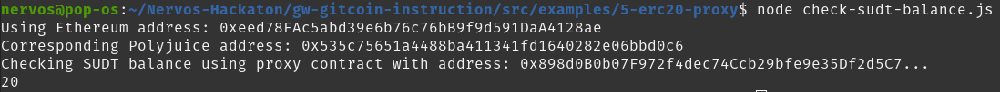
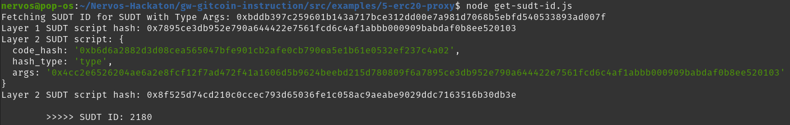

# 1. A screenshot of the console output immediately after deploying smart contract

# 2. The address of the ERC20 Proxy Contract you deployed (in text format)

0x898d0B0b07F972f4dec74Ccb29bfe9e35Df2d5C7

# 3. A screenshot of the console output immediately after checking your SUDT balance

# 4. The Ethereum address that was checked (in text format)

0xeed78FAc5abd39e6b76c76bB9f9d591DaA4128ae

# 5. Bonus

