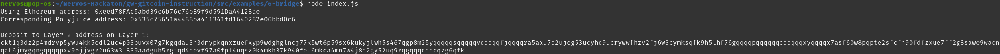
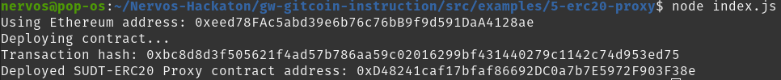
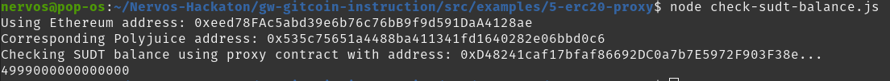

# Gitcoin: 6 - Use Force Bridge to Deposit Tokens From Ethereum to Polyjuice

https://gitcoin.co/issue/nervosnetwork/grants/7/100026213

`Force Bridge` is the decentralized cross-chain bridge which enables the transfer of assets between Nervos and other blockchains.

ETH is a native asset on Ethereum, and it is represented as a wrapped token on Nervos using ckETH SUDT tokens. The ckETH SUDT token is a native asset on Nervos, and it can be used both on Layer 1 and Layer 2, and is widely supported by all tooling within the Nervos ecosystem.

## Prerequisites

`gw-gitcoin-instruction` is already installed.

## 1. Configure MetaMask to Use the Rinkeby Testnet

Faucet : https://app.mycrypto.com/faucet

## 2. Calculate Your Layer 2 Deposit Receiver Address

Replace `<YOUR_ETHEREUM_ADDRESS>` in `gw-gitcoin-instruction/src/examples/6-bridge/index.js` with the Ethereum address where I wish to receive some layer 2 ckETH tokens.

```bash
node index.js
```



Output :
```
Using Ethereum address: 0xeed78FAc5abd39e6b76c76bB9f9d591DaA4128ae
Corresponding Polyjuice address: 0x535c75651a4488ba411341fd1640282e06bbd0c6

Deposit to Layer 2 address on Layer 1: 
ckt1q3dz2p4mdrvp5ywu4kk5edl2uc4p03puvx07g7kgqdau3n3dmypkqnxzuefxyp9wdghglncj77k5wt6p59sx6kukyjlwh5s467qgp8m25yqqqqqsqqqqqvqqqqqfjqqqqra5axu7q2ujeg53ucyhd9ucrywwfhzv2fj6w3cymksqfk9h5lhf76gqqqqpqqqqqqcqqqqqxyqqqqx7asf60w8pqpte2sfcfn90fdfzxue7ff2g8sawe9wacnqat6jmygqngqqqqpxv9ejjvgz2u63w3l839aadguh5rgtqd4devf97a0fpt4uqsz0k4mkh37k940feu6mkca4mn7w4j8d2gy52uq9rqgqqqqqqcqzg6qfk
```

The long address at the bottom of the output is your deposit receiver address. This is a Layer 1 address that is used to automatically transfer funds to Layer 2. We will use this with Force Bridge in the next step.

## 3. Initiate a Force Bridge Transfer

Force Bridge Testnet : https://force-bridge-test.ckbapp.dev/bridge/Ethereum/Nervos
Transfer `0.005 ETH` to Layer 2 `ckETH` for the recipient `ckt1q3dz2p4mdrvp5ywu4kk5edl2uc4p03puvx07g7kgqdau3n3dmypkqnxzuefxyp9wdghglncj77k5wt6p59sx6kukyjlwh5s467qgp8m25yqqqqqsqqqqqvqqqqqfjqqqqra5axu7q2ujeg53ucyhd9ucrywwfhzv2fj6w3cymksqfk9h5lhf76gqqqqpqqqqqqcqqqqqxyqqqqx7asf60w8pqpte2sfcfn90fdfzxue7ff2g8sawe9wacnqat6jmygqngqqqqpxv9ejjvgz2u63w3l839aadguh5rgtqd4devf97a0fpt4uqsz0k4mkh37k940feu6mkca4mn7w4j8d2gy52uq9rqgqqqqqqcqzg6qfk`.

After the confirmations of the Ethereum transaction, the SUDT are on Nervos Layer 1. Once they are picked up by a validator node, the SUDT tokens will released on Layer 2 to the user's Ethereum account. 


Now, I should have `0.005 ckETH` on Layer 2.
Ethereum transaction : https://rinkeby.etherscan.io/tx/0x98afd711f24fe980ec352b874cd85516ac147ac6a9ad5410ca943c32f820eda1
Nervos transaction : https://explorer.nervos.org/aggron/transaction/0x10c4e504b876ccc7aa847a2c09e2a2b61a031fb37aeb23f88cdaefbf91c7bb60
In one click we are able to bridge tokens from a blockchain to another an from layer 1 to layer 2, probably because the data in the Ethereum transaction triggers another in the Nervos network.

## Bonus: Check Your Layer 2 Balance

The `ckETH` token from Force Bridge use well-known SUDT ID `30`. We need a proxy contract to interact with it, but I don't have the address of a proxy contract for SUDT ID `30`, so let's deploy one :


Ouput :
```
Using Ethereum address: 0xeed78FAc5abd39e6b76c76bB9f9d591DaA4128ae
Deploying contract...
Transaction hash: 0xbc8d8d3f505621f4ad57b786aa59c02016299bf431440279c1142c74d953ed75
Deployed SUDT-ERC20 Proxy contract address: 0xD48241caf17bfaf86692DC0a7b7E5972F903F38e
```

Let's call the `balanceOf()` method of this contract :


Output :
```
Using Ethereum address: 0xeed78FAc5abd39e6b76c76bB9f9d591DaA4128ae
Corresponding Polyjuice address: 0x535c75651a4488ba411341fd1640282e06bbd0c6
Checking SUDT balance using proxy contract with address: 0xD48241caf17bfaf86692DC0a7b7E5972F903F38e...
4999000000000000
```

This is the amount of `Wei` (0.005 Eth) minus the transaction fees, so the transfer from Ethereum Rinkeby testnet to Nervos testnet Layer 2 was successfull.