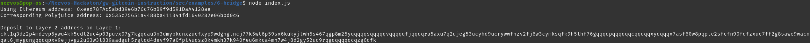
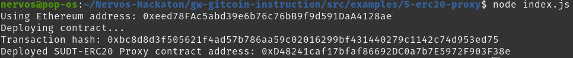
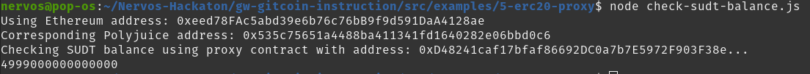

# 1. A screenshot of the console output immediately after you have successfully generated your Deposit Receiver Address

# 2. Your Deposit Receiver Address (in text format)

ckt1q3dz2p4mdrvp5ywu4kk5edl2uc4p03puvx07g7kgqdau3n3dmypkqnxzuefxyp9wdghglncj77k5wt6p59sx6kukyjlwh5s467qgp8m25yqqqqqsqqqqqvqqqqqfjqqqqra5axu7q2ujeg53ucyhd9ucrywwfhzv2fj6w3cymksqfk9h5lhf76gqqqqpqqqqqqcqqqqqxyqqqqx7asf60w8pqpte2sfcfn90fdfzxue7ff2g8sawe9wacnqat6jmygqngqqqqpxv9ejjvgz2u63w3l839aadguh5rgtqd4devf97a0fpt4uqsz0k4mkh37k940feu6mkca4mn7w4j8d2gy52uq9rqgqqqqqqcqzg6qfk

# 3. The Ethereum address used to generate the Deposit Receiver Address (in text format)

0xeed78FAc5abd39e6b76c76bB9f9d591DaA4128ae

# 4. A link to the Etherscan explorer for the successful Force Bridge transaction. This can be found on Force Bridge under History→Succeed

https://rinkeby.etherscan.io/tx/0x98afd711f24fe980ec352b874cd85516ac147ac6a9ad5410ca943c32f820eda1

# 5. A link to the Nervos explorer for the successful Force bridge transaction. This can be found on Force Bridge under History→Succeed

https://explorer.nervos.org/aggron/transaction/0x10c4e504b876ccc7aa847a2c09e2a2b61a031fb37aeb23f88cdaefbf91c7bb60

# Bonus

