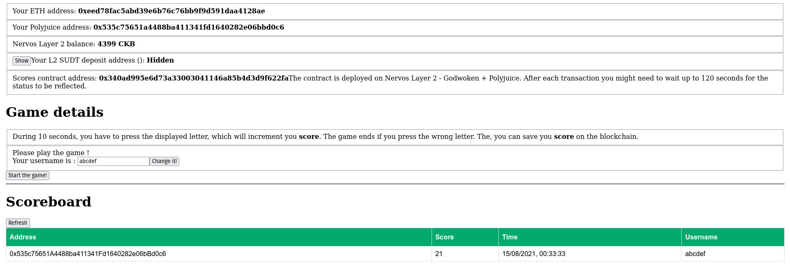
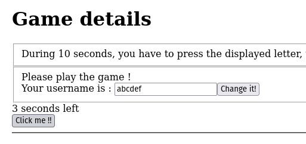
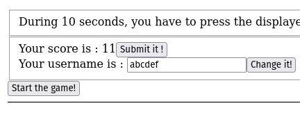
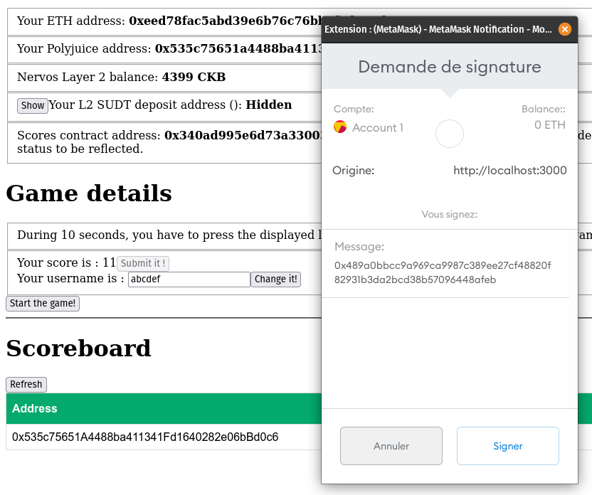
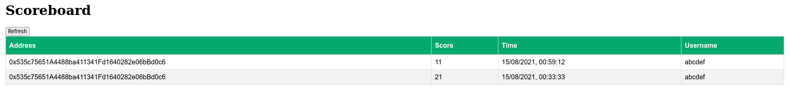
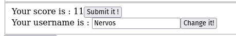
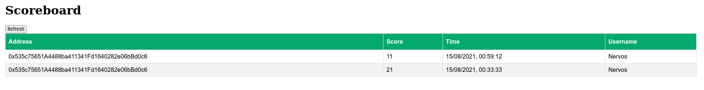

# 1. Screenshots or video of your application running on Godwoken

## UI presentation



## Play the click game



## The game has ended, let's submit my score !





## The scoreboard is now updated with my last score



## Let's change my username from 'abcdef' to 'Nervos'



## The scoreboard is now updated with my new username



# 2. Link to the GitHub repository with your application which has been ported to Godwoken. This must be a different application than the one covered in this guide

https://github.com/Schrubitteflau/Nervos-7-Click-The-Block

# 3. If you deployed any smart contracts as part of this tutorial, please provide the transaction hash of the deployment transaction, the deployed contract address, and the ABI of the deployed smart contract. (Provide all in text format.)

Deploy transaction hash: 0x9e4a97269a6891729ccf16346d16d56fd77eb9399bb2e049dcf602a7dea6fc4e

Deployed contract address: 0x340aD995E6d73a33003041146a85B4D3d9F622fa

ABI :
```json
[
    {
        "inputs": [
            {
                "internalType": "uint256",
                "name": "",
                "type": "uint256"
            }
        ],
        "name": "scores",
        "outputs": [
            {
                "internalType": "address",
                "name": "user",
                "type": "address"
            },
            {
                "internalType": "uint256",
                "name": "score",
                "type": "uint256"
            },
            {
                "internalType": "uint256",
                "name": "time",
                "type": "uint256"
            }
        ],
        "stateMutability": "view",
        "type": "function"
    },
    {
        "inputs": [
            {
                "internalType": "address",
                "name": "",
                "type": "address"
            }
        ],
        "name": "usernames",
        "outputs": [
            {
                "internalType": "string",
                "name": "",
                "type": "string"
            }
        ],
        "stateMutability": "view",
        "type": "function"
    },
    {
        "inputs": [
            {
                "internalType": "uint256",
                "name": "_score",
                "type": "uint256"
            }
        ],
        "name": "addScore",
        "outputs": [],
        "stateMutability": "nonpayable",
        "type": "function"
    },
    {
        "inputs": [
            {
                "internalType": "string",
                "name": "_username",
                "type": "string"
            }
        ],
        "name": "setUsername",
        "outputs": [],
        "stateMutability": "nonpayable",
        "type": "function"
    },
    {
        "inputs": [],
        "name": "scoresCount",
        "outputs": [
            {
                "internalType": "uint256",
                "name": "",
                "type": "uint256"
            }
        ],
        "stateMutability": "view",
        "type": "function"
    },
    {
        "inputs": [
            {
                "internalType": "uint256",
                "name": "_count",
                "type": "uint256"
            }
        ],
        "name": "getLatestScores",
        "outputs": [
            {
                "components": [
                    {
                        "internalType": "address",
                        "name": "user",
                        "type": "address"
                    },
                    {
                        "internalType": "uint256",
                        "name": "score",
                        "type": "uint256"
                    },
                    {
                        "internalType": "uint256",
                        "name": "time",
                        "type": "uint256"
                    },
                    {
                        "internalType": "string",
                        "name": "username",
                        "type": "string"
                    }
                ],
                "internalType": "struct Scores.ScoreWithUsername[]",
                "name": "",
                "type": "tuple[]"
            }
        ],
        "stateMutability": "view",
        "type": "function"
    }
]
```