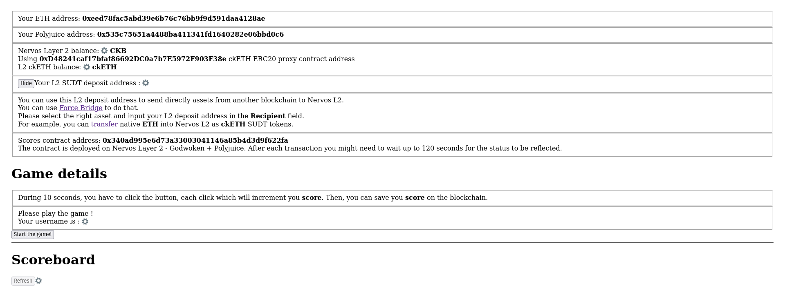
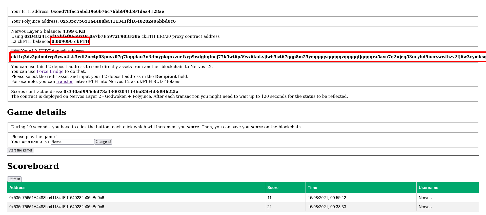
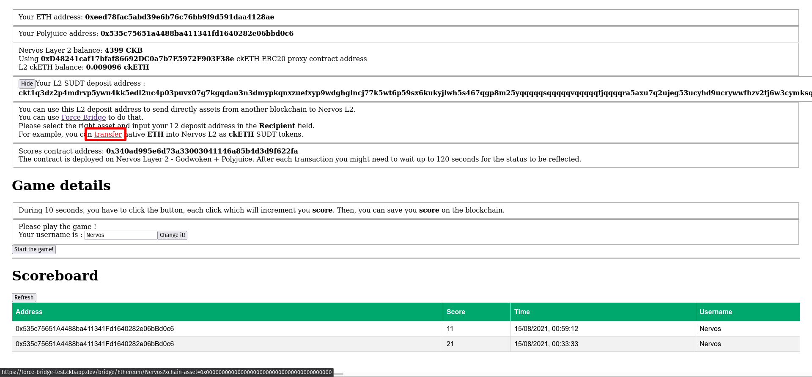
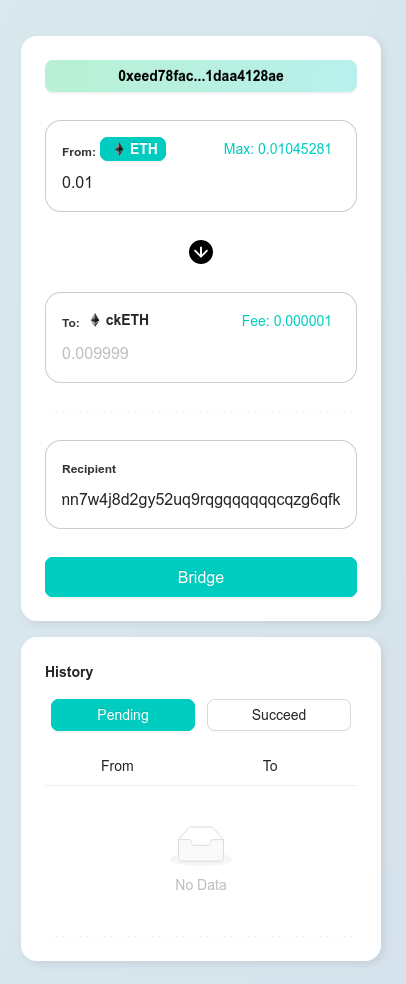
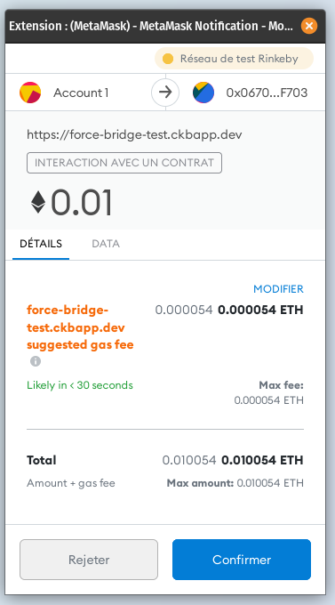
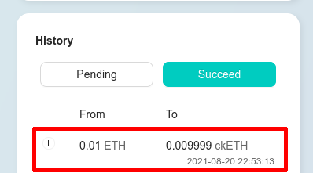
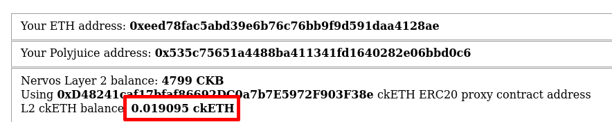
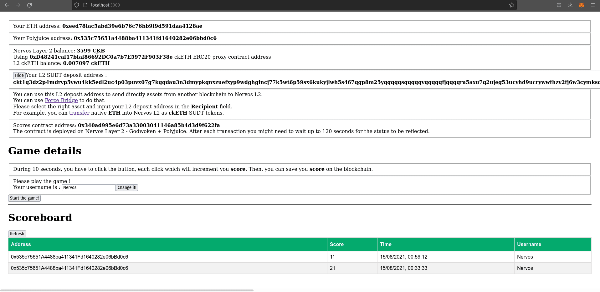
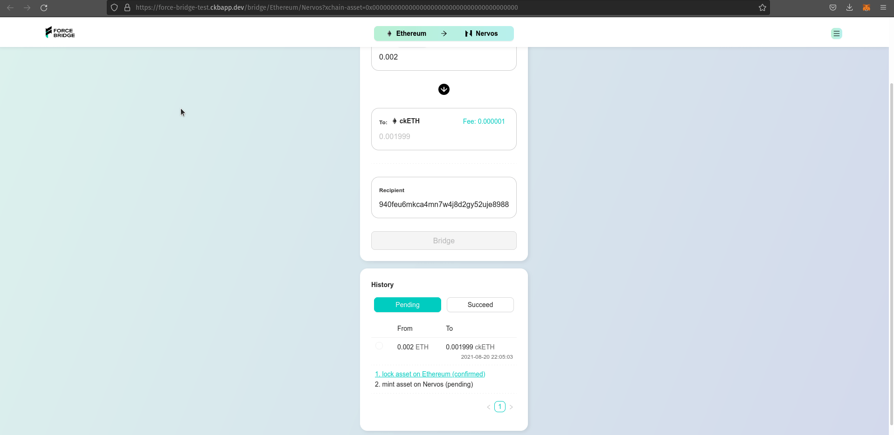
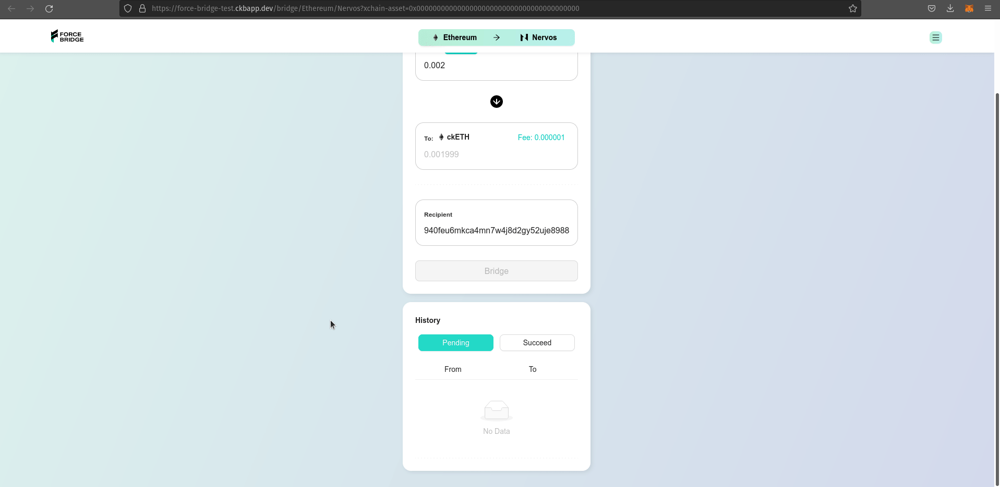

# 1. A screenshot or video of your EVM application on Layer 2 with Force Bridge support

## Open the app and wait while the values are loading

## Check your L2 ckETH balance

## Click on "transfer" and get redirected in Force Bridge app

## Enter the amount of ETH to transfer to L2 and fill the recipient with your L2 deposit address

## Sign the transaction

## Wait for the bridge transfer to be completed

## Reload the app and see the new amount of ckETH

## Gifs

There are also gifs file showing this entire process.

# 2. The address of the SUDT-ERC20 Proxy Contract that you deployed (in text format)

0xD9AF85FcBEc4C60d3a6E3175c88Df58aE27095D6

# 3. A link to the GitHub repository with your EVM application that integrates Force Bridge support

https://github.com/Schrubitteflau/Nervos-8-Click-The-Block
