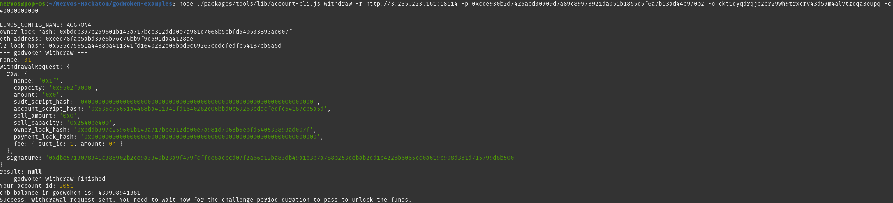

# Gitcoin: 9 - Initiate Withdrawal Process from the Layer 2 back to Layer 1

https://gitcoin.co/issue/nervosnetwork/grants/10/100026216

## 1. Execute the Withdraw Command

```bash
cd godwoken-examples
node ./packages/tools/lib/account-cli.js withdraw -r <INSERT_TESTNET_RPC_URL> -p <YOUR_ETHEREUM_PRIVATE_KEY> -o <YOUR_LAYER_1_ADDRESS> -c <SHANNONS_AMOUNT>
```

The command becomes :
```bash
node ./packages/tools/lib/account-cli.js withdraw -r http://3.235.223.161:18114 -p 0xcde930b2d7425acd30909d7a89c89978921da051b1855d5f6a7b13ad44c970b2 -o ckt1qyqdrqjc2cr29wh9trxcrv43d59m4alvtzdqa3eupq -c 40000000000
```



Output :
```
LUMOS_CONFIG_NAME: AGGRON4
owner lock hash: 0xbddb397c259601b143a717bce312dd00e7a981d7068b5ebfd540533893ad007f
eth address: 0xeed78fac5abd39e6b76c76bb9f9d591daa4128ae
l2 lock hash: 0x535c75651a4488ba411341fd1640282e06bbd0c69263cddcfedfc54187cb5a5d
--- godwoken withdraw ---
nonce: 31
withdrawalRequest: {
  raw: {
    nonce: '0x1f',
    capacity: '0x9502f9000',
    amount: '0x0',
    sudt_script_hash: '0x0000000000000000000000000000000000000000000000000000000000000000',
    account_script_hash: '0x535c75651a4488ba411341fd1640282e06bbd0c69263cddcfedfc54187cb5a5d',
    sell_amount: '0x0',
    sell_capacity: '0x2540be400',
    owner_lock_hash: '0xbddb397c259601b143a717bce312dd00e7a981d7068b5ebfd540533893ad007f',
    payment_lock_hash: '0x0000000000000000000000000000000000000000000000000000000000000000',
    fee: { sudt_id: 1, amount: 0n }
  },
  signature: '0xdbe5713078341c385902b2ce9a3340b23a9f479fcffde8acccd07f2a66d12ba83db49a1e3b7a788b253debab2dd1c4228b6065ec0a619c908d381d715799d8b500'
}
result: null
--- godwoken withdraw finished ---
Your account id: 2051
ckb balance in godwoken is: 439998941381
Success! Withdrawal request sent. You need to wait now for the challenge period duration to pass to unlock the funds.
```

Withdrawing from Nervos Layer 2 is a two step process, first the withdrawal is initiated with the withdrawl command, and then it is later unlocked with the unlock command after the five day challenge period. However, executing the unlock command is part of the next task, and is not needed for this task.
