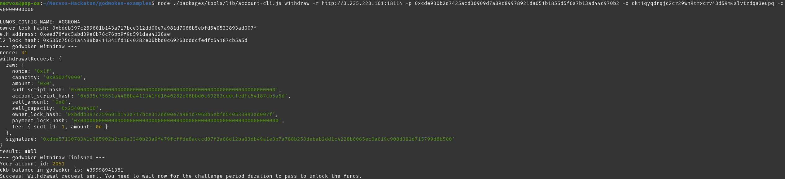

# 1. A screenshot of the console output immediately after running the withdraw command

# 2. The Ethereum address that you've used for your Layer 2 account (in text format)

0xeed78fac5abd39e6b76c76bb9f9d591daa4128ae

# 3. The Nervos Layer 1 address that you passed to withdraw command (in text format)

ckt1qyqdrqjc2cr29wh9trxcrv43d59m4alvtzdqa3eupq
